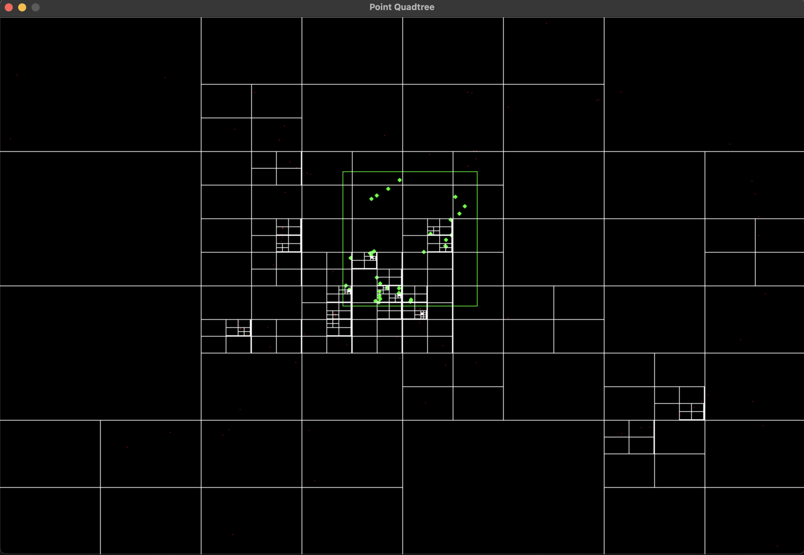

# Python3 Point Quadtree

A point quadtree implementation with python3 and pygame for 2d graphics. Clicking or scrolling the mouse wheel inserts new points into the quadtree. The root node's rectangular boundary is the entire 1200x800 display. As points are added to the tree, nodes will subdivide into four additional nodes (ne, nw, se, sw) when they have stored as many points as their capacity will allow them. Each node in the tree is represented by a white rectangle. There's a rect that's drawn around the mouse cursor which is the area we search query the tree for to find points. The found points are rendered green.

## Install

```
python3 -m venv venv
source venv/bin/activate
pip3 install -r requirements.txt
```

## Run

```bash
python3 main.py
```

## Demo
